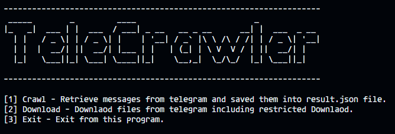

# **TeleCrawler**
**TeleCrawler** is TUI app that lets you retrieve telegram messages and download any files including restricted files using **Bot token** and **Message URL**.

## **Installation**
- Clone the repository.

```sh
git clone https://github.com/NYDEV0/TeleCrawler
```
- Navigate to TeleCrawler.
```sh
cd TeleCrawler
```
- Install dependecy packages.
```sh
pip install -r requirements.txt
```

## **Dependencies**
* [pyrogram]()

## **Usage**
Once you download files and install requirements follow this steps.
- Run the main file
```sh 
python3 crawler.py
```
- When prompted to give the bot token, provide the Telegram bot token obtained from [Bot Father](https://t.me/botfather).
- When prompted to provide the Initial and Final message URL, use a Telegram link in the following format: https://t.me/channel_username/message_id.
- Once done, if you choose to download the file or crawl the messages, the progress will be shown by printing it.
